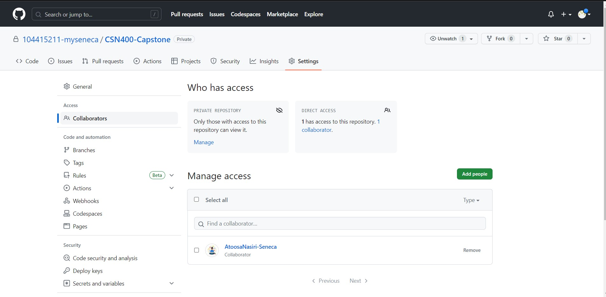

# Checkpoint1 Submission

- **COURSE INFORMATION: CSN400-2234**
- **STUDENT’S NAME: Parav Gagneja**
- **STUDENT'S NUMBER: 104415211**
- **GITHUB USER_ID: 104415211-myseneca** 
- **TEACHER’S NAME: Atoosa Nasiri**

### Table of Contents
- [My Collaboration Image](#my-collaboration-image)
- single line code snippet
- multi line code snippet (preferably bash script"
- sample json objects
- sample table
- sample hyperlink

### My Collaboration Image
<p align="center";>My collaboration image with AtoosaNasiri-Seneca</p>



### My Single Line Code
To convert single line code to `embedded code` use single backticks.

### My Multiplt Line Code
Here's the example of Multiple line embedded code
```bash
#!/bin/bash

params=(
    show
    hello,
    world
    "multi word"
)
function show {
    echo --- Showing \""$@"\" as parameters ---
    for i in "$@"; do
        echo i=$i
    done
}
```

### My Sample json object
`json object` represented with `Markdown Language` will look like following:

```json
{ 
    "employee": {
        "Campus": [
            {"id":1,"name":"Robert Downey"},
            {"id":2,"name":"Elizabeth Olsen"}
        ],
        "country": {"id":2,"company":"MARVEL"}
    }, 
    "brewing": {
        "region": [
            {"id":1,"name":"Robert Downey"},
            {"id":2,"name":"Elizabeth Olsen"}
        ],
        "country": {"id":2,"company":"MARVEL"}
    }
}
```

### Table 
Let's learn how to create table using Markdown language:

| Coding Languages | Description |
| - | - |
| `Python` | Python is a high-level, versatile programming language known for its simplicity and readability.|
| `JavaScript` | JavaScript is a dynamic, interpreted programming language primarily used for web development.|
| `C++` | C++ is a powerful, general-purpose programming language that extends the C language with additional features like object-oriented programming |

### Hyperlink 
- [Introduction to HTMl](https://www.geeksforgeeks.org/html-introduction/)
