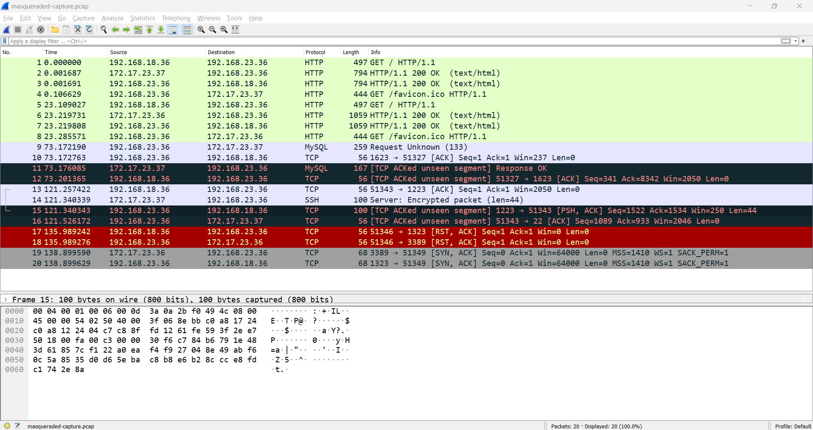
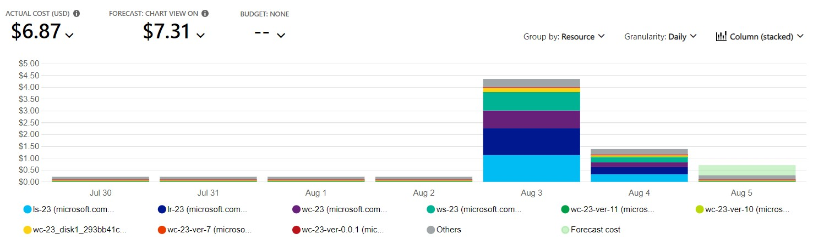
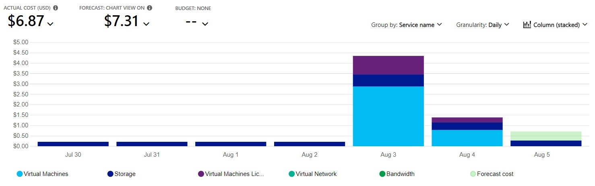
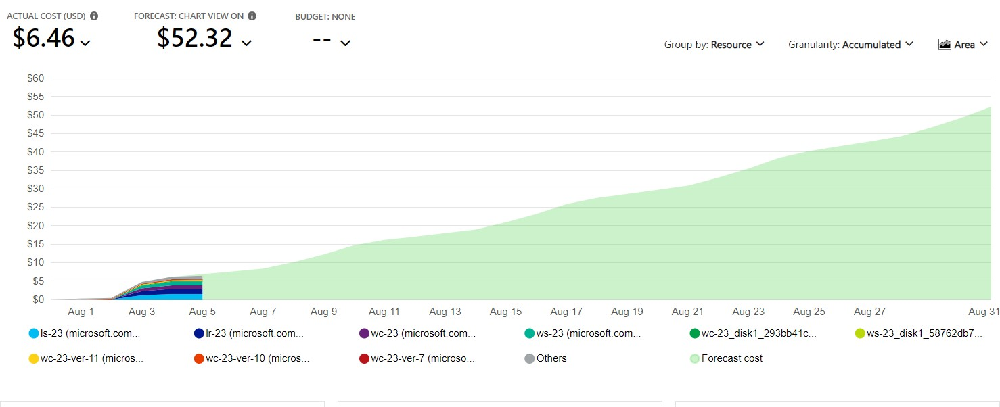
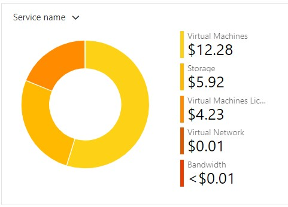
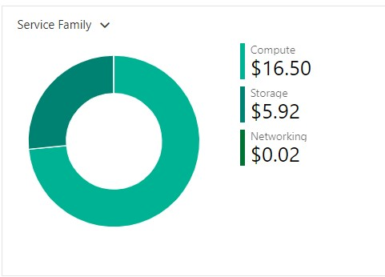
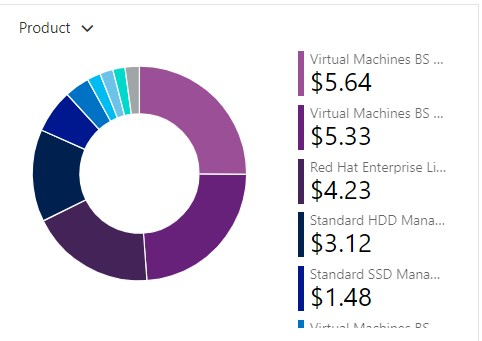

# Checkpoint10 Submission

- **COURSE INFORMATION: CSN400NAA-2234**
- **STUDENT’S NAME: Parav Gagneja**
- **STUDENT'S NUMBER: 104415211**
- **GITHUB USER ID: 104415211-myseneca**
- **TEACHER’S NAME: Atoosa Nasiri**

### Table of Contents

- [Checkpoint10 Submission](#checkpoint10-submission)
    - [Table of Contents](#table-of-contents)
    - [Part A - Route Table Updates](#part-a---route-table-updates)
    - [Part B – Port Forwarding Basic Connectivity](#part-b--port-forwarding-basic-connectivity)
    - [Part C – Logging \& Isolating Masqueraded Packets](#part-c--logging--isolating-masqueraded-packets)
    - [Part D - Azure Cost Analysis Charts](#part-d---azure-cost-analysis-charts)

### Part A - Route Table Updates

```
List of Route Tables

odl_user [ ~ ]$ az network route-table list --output table
DisableBgpRoutePropagation    Location    Name      ProvisioningState    ResourceGroup      ResourceGuid
----------------------------  ----------  --------  -------------------  -----------------  ------------------------------------
False                         canadaeast  RT-23     Succeeded            Student-RG-954636  915695e3-668f-460e-a968-ab3691a589c4
False                         canadaeast  RT-EX-23  Succeeded            Student-RG-954636  4fadd42c-098c-4275-8561-8350c570a771
```
<br>

```
List of Routes

Route Table: RT-23

odl_user [ ~ ]$ az network route-table route list --resource-group Student-RG-954636 --route-table-name RT-23 --output table
AddressPrefix     HasBgpOverride    Name              NextHopIpAddress    NextHopType       ProvisioningState    ResourceGroup
----------------  ----------------  ----------------  ------------------  ----------------  -------------------  -----------------
172.17.23.32/27   False             Route-to-Server   192.168.23.36       VirtualAppliance  Succeeded            Student-RG-954636
10.36.199.0/24    False             Route-to-Desktop  192.168.23.36       VirtualAppliance  Succeeded            Student-RG-954636
192.168.18.32/27  False             External-Router   192.168.23.36       VirtualAppliance  Succeeded            Student-RG-954636


Route Table: RT-EX-23

odl_user [ ~ ]$ az network route-table route list --resource-group Student-RG-954636 --route-table-name RT-EX-23 --output table
AddressPrefix     HasBgpOverride    Name          NextHopIpAddress    NextHopType       ProvisioningState    ResourceGroup
----------------  ----------------  ------------  ------------------  ----------------  -------------------  -----------------
192.168.18.32/27  False             Route-to-Hub  192.168.99.36       VirtualAppliance  Succeeded            Student-RG-954636
```
<br>

```
Subnets

Vnet: Server-23

odl_user [ ~ ]$ az network vnet subnet list --resource-group Student-RG-954636 --vnet-name Server-23 --output table
AddressPrefix     Name    PrivateEndpointNetworkPolicies    PrivateLinkServiceNetworkPolicies    ProvisioningState    ResourceGroup
----------------  ------  --------------------------------  -----------------------------------  -------------------  -----------------
172.17.23.64/27   SN2     Disabled                          Enabled                              Succeeded            Student-RG-954636
172.17.23.96/27   SN3     Disabled                          Enabled                              Succeeded            Student-RG-954636
172.17.23.128/27  SN4     Disabled                          Enabled                              Succeeded            Student-RG-954636
172.17.23.32/27   SN1     Disabled                          Enabled                              Succeeded            Student-RG-954636


Vnet: Student-954636-vnet

odl_user [ ~ ]$ az network vnet subnet list --resource-group Student-RG-954636 --vnet-name Student-954636-vnet --output table
AddressPrefix    Name                    PrivateEndpointNetworkPolicies    PrivateLinkServiceNetworkPolicies    ProvisioningState    ResourceGroup
---------------  ----------------------  --------------------------------  -----------------------------------  -------------------  -----------------
10.36.199.0/24   Virtual-Desktop-Client  Enabled                           Enabled                              Succeeded            Student-RG-954636


Vnet: Router-23

odl_user [ ~ ]$ az network vnet subnet list --resource-group Student-RG-954636 --vnet-name Router-23 --output table
AddressPrefix      Name    PrivateEndpointNetworkPolicies    PrivateLinkServiceNetworkPolicies    ProvisioningState    ResourceGroup
-----------------  ------  --------------------------------  -----------------------------------  -------------------  -----------------
192.168.23.64/27   SN2     Disabled                          Enabled                              Succeeded            Student-RG-954636
192.168.23.96/27   SN3     Disabled                          Enabled                              Succeeded            Student-RG-954636
192.168.23.128/27  SN4     Disabled                          Enabled                              Succeeded            Student-RG-954636
192.168.23.32/27   SN1     Disabled                          Enabled                              Succeeded            Student-RG-954636
```

<br>

### Part B – Port Forwarding Basic Connectivity

```
nat_basic-connectivity.sh


# to flush NAT tables
iptables -t nat -F

# to allow other students to access APACHE server
iptables -t nat -A PREROUTING -p tcp --dport 1823 -j DNAT --to-destination 172.17.23.37:80

# to allow other students to access MySQL server
iptables -t nat -A PREROUTING -p tcp --dport 1623 -j DNAT --to-destination 172.17.23.37:3306

# to allow other students to access Linux server - SSH
iptables -t nat -A PREROUTING -p tcp --dport 1223 -j DNAT --to-destination 172.17.23.37:22

# to allow other students to access IIS server
iptables -t nat -A PREROUTING -p tcp --dport 1923 -j DNAT --to-destination 172.17.23.36:80

# to allow other students to access Windows server - RDP
iptables -t nat -A PREROUTING -p tcp --dport 1323 -j DNAT --to-destination 172.17.23.36:3389

#POSTROUTING
iptables -t nat -A POSTROUTING -o eth0 -j MASQUERADE
```
### Part C – Logging & Isolating Masqueraded Packets

```
masqueraded-logged.log


### HTTP	Hub or Partner Router	RANDOM(1)	Your Windows Server	80
Aug  4 00:19:30 LR-23 kernel: TO_DROP_FORWARDIN=eth0 OUT=eth0 MAC=00:0d:3a:0a:2b:f0:ac:3d:94:1b:f5:c4:08:00 SRC=192.168.18.36 DST=172.17.23.36 LEN=40 TOS=0x00 PREC=0x00 TTL=125 ID=40342 DF PROTO=TCP SPT=51321 DPT=80 WINDOW=2050 RES=0x00 ACK FIN URGP=0


### HTTP	Hub or Partner Router	RANDOM(2)	Your Linux Server	80
Aug  4 00:18:05 LR-23 kernel: TO_DROP_FORWARDIN=eth0 OUT=eth0 MAC=00:0d:3a:0a:2b:f0:ac:3d:94:1b:f5:c4:08:00 SRC=192.168.18.36 DST=172.17.23.37 LEN=40 TOS=0x00 PREC=0x00 TTL=125 ID=40290 DF PROTO=TCP SPT=51299 DPT=80 WINDOW=2050 RES=0x00 ACK URGP=0


### MySQL	Hub or Partner Router	RANDOM(3)	Your Linux Server	3306
Aug  4 00:18:27 LR-23 kernel: TO_DROP_FORWARDIN=eth0 OUT=eth0 MAC=00:0d:3a:0a:2b:f0:ac:3d:94:1b:f5:c4:08:00 SRC=192.168.18.36 DST=172.17.23.37 LEN=40 TOS=0x00 PREC=0x00 TTL=125 ID=40314 DF PROTO=TCP SPT=51327 DPT=3306 WINDOW=2049 RES=0x00 ACK URGP=0


### RDP	Hub or Partner Router	RANDOM(4)	Your Windows Server	3389
Aug  4 00:22:34 LR-23 kernel: TO_DROP_FORWARDIN=eth0 OUT=eth0 MAC=00:0d:3a:0a:2b:f0:ac:3d:94:1b:f5:c4:08:00 SRC=192.168.18.36 DST=172.17.23.36 LEN=40 TOS=0x00 PREC=0x00 TTL=125 ID=40821 DF PROTO=TCP SPT=51349 DPT=3389 WINDOW=0 RES=0x00 ACK RST URGP=0


### SSH	Hub or Partner Router	RANDOM(5)	Your Linux Server	22
Aug  4 01:09:18 LR-23 kernel: TO_DROP_FORWARDIN=eth0 OUT=eth0 MAC=00:0d:3a:0a:2b:f0:ac:3d:94:1b:f5:c4:08:00 SRC=192.168.18.36 DST=172.17.23.37 LEN=88 TOS=0x08 PREC=0x40 TTL=62 ID=6033 DF PROTO=TCP SPT=49790 DPT=22 WINDOW=300 RES=0x00 ACK PSH URGP=0
```

`masqueraded-capture.pcap``



### Part D - Azure Cost Analysis Charts

| No. | Scope | Chart Type | VIEW Type |  Date Range | Group By | Granularity| Example |
|-|-|-|-|-|-|-|-|
|1|Student-RG-954636| Column (Stacked) | DailyCosts | Last 7 Days | Resource | Daily |  |
|2|Student-RG-954636| Column (Stacked) | DailyCosts | Last 7 Days | Service | Daily |  |
|3|Student-RG-954636| Area| AccumulatedCosts | Last 7 Days | Resource | Accumulated |  |
|4|Student-RG-954636| Pie Chart | NA | Last Month | Service Name | NA |  |
|5|Student-RG-954636| Pie Chart | NA | Last Month | Service Family | NA |  |
|6|Student-RG-954636| Pie Chart | NA | Last Month | Product | NA |  |