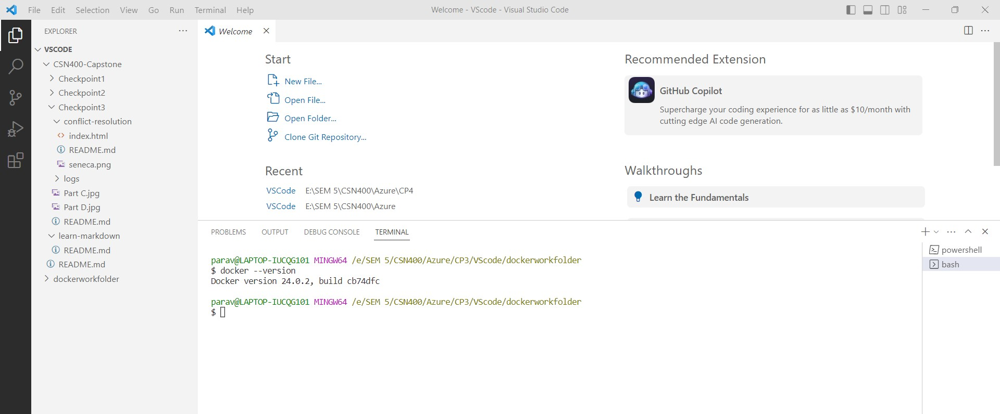

# Checkpoint4 Submission

- **COURSE INFORMATION: CSN400-2234**
- **STUDENT’S NAME: Parav Gagneja**
- **STUDENT'S NUMBER: 104415211**
- **GITHUB USER_ID: 104415211-myseneca** 
- **TEACHER’S NAME: Atoosa Nasiri**

### Table of Contents
- [Checkpoint4 Submission](#checkpoint4-submission)
    - [Table of Contents](#table-of-contents)
    - [Part A - Working with Docker Desktop:](#part-a---working-with-docker-desktop)
    - [Part B -Run Your own container:](#part-b--run-your-own-container)
    - [Part C - Run Docker Hub Image:](#part-c---run-docker-hub-image)
    - [Part D - Publish your images:](#part-d---publish-your-images)

### Part A - Working with Docker Desktop:
<em>
<ol type="I" style="color: green">
<li>Dockerhub Account Created</li>
 

 
<li>Docker Desktop and  Windows Subsystem for Linux (WSL) installing</li>
 

 
<li>Hyper-V enabled</li>
 

 
<li>Docker Version</li>
 

 
<li>Docker Set up</li>
 

 
</ol>
</em>

### Part B -Run Your own container:
### Part C - Run Docker Hub Image:
### Part D - Publish your images:
