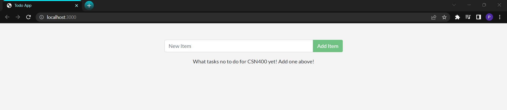
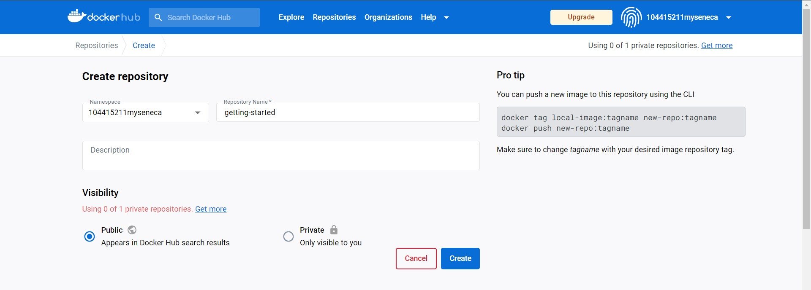
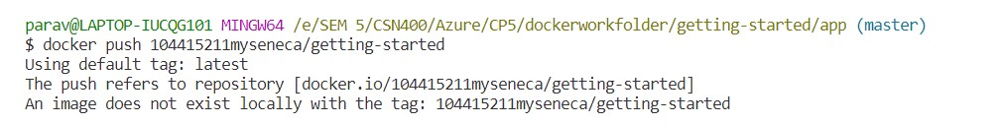
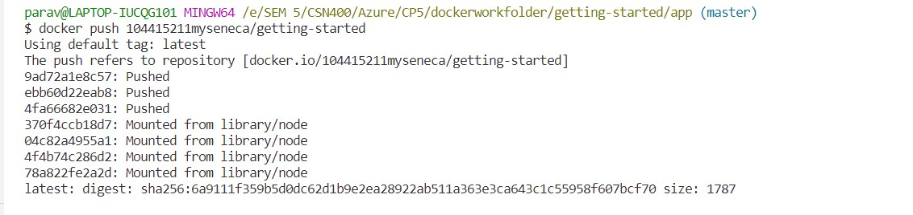
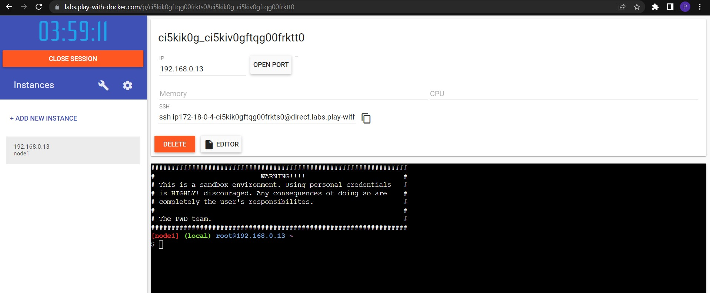
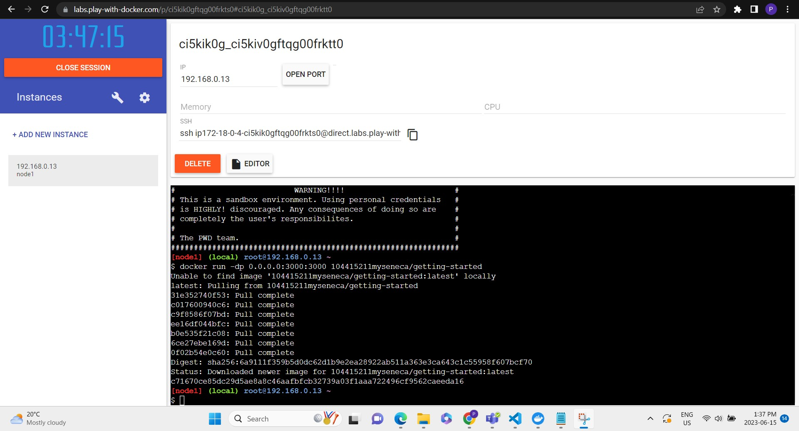
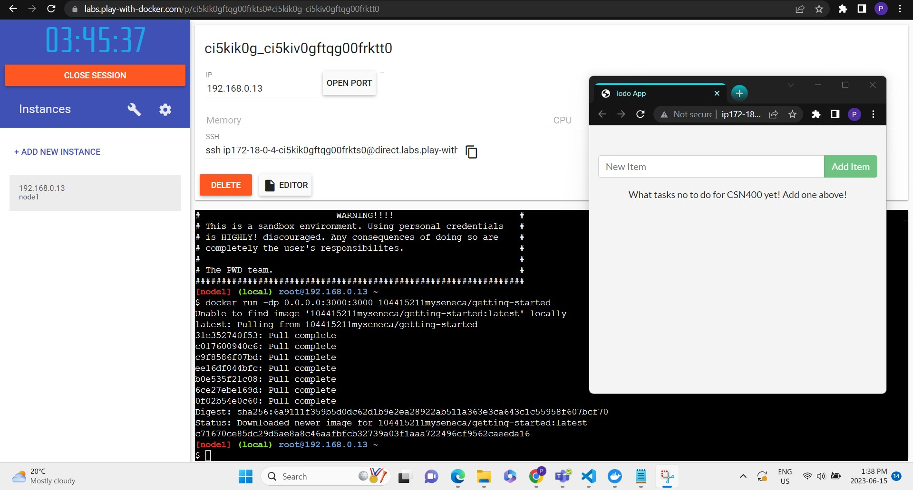

# Checkpoint5 Submission

- **COURSE INFORMATION: CSN400-2234**
- **STUDENT’S NAME: Parav Gagneja**
- **STUDENT'S NUMBER: 104415211**
- **GITHUB USER ID: 104415211-myseneca**
- **TEACHER’S NAME: Atoosa Nasiri**


### Table of Contents
- [Checkpoint5 Submission](#checkpoint5-submission)
    - [Table of Contents](#table-of-contents)
    - [Part A - Containerize an application](#part-a---containerize-an-application)
    - [Part B - Share the application](#part-b---share-the-application)
    - [Part C - Persist the DB](#part-c---persist-the-db)
    - [Part D - Multi container apps](#part-d---multi-container-apps)

### Part A - Containerize an application
<b>Question 1:</b>
``` 
So, when we ran `docker build -t getting-started .` second time, the build time was less as docker 
had a built-in cache memory which was created while creating the image first time, second time docker 
just processed those steps back which causes less steps and less time but if any modification would be 
done at any step then docker has to create steps again. 
```
<b>Question 2:</b>
``` bash
Answer: The argument "-t" is used to display tag on image, this tag can be verified using command "docker image ls".
if the argument "-t" is missing this error will pop-up, which means command need the
argument
 
parav@LAPTOP-IUCQG101 MINGW64 /e/SEM 5/CSN400/Azure/CP5/dockerworkfolder/getting-started/app (master)
$ docker build getting-started .
ERROR: "docker buildx build" requires exactly 1 argument.
See 'docker buildx build --help'.

Usage:  docker buildx build [OPTIONS] PATH | URL | -

Start a build
```

<b>Question 3:</b>
``` 
Docker uses layered architecture model which means whenever we create an image or modify image it just
add a new layer to it to reduce duplication, so when we used same command without modification docker 
used same code from cache memory and recognised the same existing layer, that's why we are only able to 
see one image file even we use "docker build -t getting-started ." multiple times.
```

<b>Question 4:</b>
``` bash
"-d" flag stands for detached mode, which means container gonna run in backgound without being attached to 
terminal. This mode is useful for servies which don't need user interaction and keep on running in background.

"-p" flag stands for port mapping, which connects localhost port's with container's port. This is very fruitful 
while running multiple containers to avoid conflict between them.

When we ran the command "docker run -p 1000:3000 getting-started" the output is embeded in following which states 
instead of running process in background now its running in foreground.

parav@LAPTOP-IUCQG101 MINGW64 /e/SEM 5/CSN400/Azure/CP5/dockerworkfolder/getting-started/app (master)
$ docker run -p 1000:3000 getting-started
Using sqlite database at /etc/todos/todo.db
Listening on port 3000

```

<b>Question 5:</b>
```
"docker run -p 1000:3000 getting-started" according to syntax <host port>:<Container port>
this means port 1000 in localhost must be used to reach container.
```

<b>Question 6:</b>
``` bash
parav@LAPTOP-IUCQG101 MINGW64 /e/SEM 5/CSN400/Azure/CP5/dockerworkfolder/getting-started/app (master)
$ docker ps
CONTAINER ID   IMAGE             COMMAND                  CREATED          STATUS          PORTS                    NAMES
c3b59c5b3379   getting-started   "docker-entrypoint.s…"   6 seconds ago    Up 5 seconds    0.0.0.0:1000->3000/tcp   nice_varahamihira
88c44be2c37c   getting-started   "docker-entrypoint.s…"   53 minutes ago   Up 53 minutes   0.0.0.0:3000->3000/tcp   hopeful_bouman

The Difference between two containers is one is running in front and other in front, which mean if I close the IDE the front
container with hostport 1000 will stop working but the container with host port 3000 running in back will keep working.
```

<b>Question 7:</b>
```
It took 10.8 seconds to create the image after updating the code. It is shorter incomparison to the first because
docker created image from the step the file was modified but the rest was same in cache, that's why it was faster.
```

<b>Question 8:</b>
``` bash
parav@LAPTOP-IUCQG101 MINGW64 /e/SEM 5/CSN400/Azure/CP5/dockerworkfolder/getting-started/app (master)
$ docker run -dp 3000:3000 getting-started
9c2e5ff43d5bf0aedb95a9115b023bd9140d364e809904fe68205346b3360b44
docker: Error response from daemon: driver failed programming external connectivity on endpoint cool_jones (95961dc7f94266ffb61356f3baaa54bf935b5fb3062e2635082156e9a984a00d): Bind for 0.0.0.0:3000 failed: port is already allocated.

The reason behind this error is, as when we created our first container we allocated port 3000 to it but now
we are trying to run another container with same port which cause this conflict. To resolve this error we deleted 
container associated with port 3000 to make it available and then allocated that to our new container.
```

<b>Question 9:</b>



### Part B - Share the application
` Create Repository`



`Push Command Failed`



`Docker tag command to give the getting-started`



`Added New Instance`



`Freshly pushed app`



`App Running`


     
### Part C - Persist the DB

``` bash
root@LAPTOP-IUCQG101:/mnt/e/SEM 5/CSN400/Azure/CP5/dockerworkfolder/getting-started/app# docker volume inspect todo-db
[
    {
        "CreatedAt": "2023-06-15T21:31:01Z",
        "Driver": "local",
        "Labels": null,
        "Mountpoint": "/var/lib/docker/volumes/todo-db/_data",
        "Name": "todo-db",
        "Options": null,
        "Scope": "local"
    }
]
```
### Part D - Multi container apps