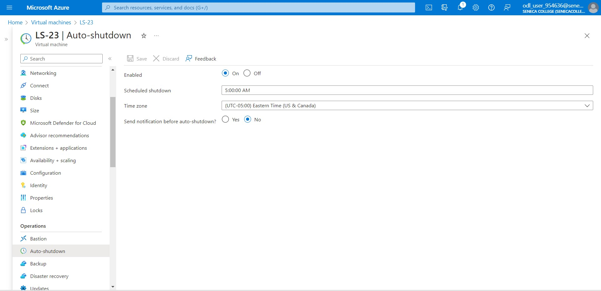

# Checkpoint6 Submission

- **COURSE INFORMATION: CSN400NAA-2234**
- **STUDENT’S NAME: Parav Gagneja**
- **STUDENT'S NUMBER: 104415211**
- **GITHUB USER ID: 104415211-myseneca**
- **TEACHER’S NAME: Atoosa Nasiri**

### Table of Contents

- [Checkpoint6 Submission](#checkpoint6-submission)
    - [Table of Contents](#table-of-contents)
    - [Part A - Creating Network Resources using Azure CLI](#part-a---creating-network-resources-using-azure-cli)
    - [Part B -  Working with Azure CLI Bash](#part-b----working-with-azure-cli-bash)
    - [Part C - Network Review Questions](#part-c---network-review-questions)
    - [Part D - Creating Virtual Machines](#part-d---creating-virtual-machines)


### Part A - Creating Network Resources using Azure CLI

``` bash 
Lines Updated in network_config.sh
RG_NAME="Student-RG-954636"
LOCATION="canadaeast"
ID="23"

Student_vnet_name="Student-954636-vnet"
Student_vnet_address="10.36.199.0/24"
Client_Subnet_name="Virtual-Desktop-Client"
Client_Subnet_address="10.36.199.0/24"
```

<b>Output of ./network_config_test.sh</b>

``` bash
root@LAPTOP-IUCQG101:/mnt/e/SEM 5/CSN400/Azure/CP6/Workfolder/CSN400-Capstone-Public/CP6-Scripts/bash-scripts# ./network_config_test.sh


---------------------------------------------------
---------------------------------------------------

    ____  ___                __    __
    |     |__   |\ |  |_|   |  |  |  |
    |___   __|  | \|    |   |__|  |__|

---------------------------------------------------
---------------------------------------------------

Loading variables:
network_config.sh
Loaded variabes without error
---------------------------------------------------
Configurations:
RG_NAME: Student-RG-954636
LOCATION: canadaeast
ID: 23

---------------------------------------------------
Networking - Virtual Networks

Student_vnet_name: Student-954636-vnet
Router_vnet_name: Router-23
Server_vnet_name: Server-23
Student_vnet_address: 10.36.199.0/24
Router_vnet_address: 192.168.23.0/24
Server_vnet_address: 172.17.23.0/24

---------------------------------------------------
Networking - Virtual Networks - Subnets

Client_Subnet_list:
Virtual-Desktop-Client


Router_Subnets_list:
SN1
192.168.23.32/27
SN2
192.168.23.64/27
SN3
192.168.23.96/27
SN4
192.168.23.128/27

Server_Subnets_list:
SN1
172.17.23.32/27
SN2
172.17.23.64/27
SN3
172.17.23.96/27
SN4
172.17.23.128/27
---------------------------------------------------
Networking - Virtual Networks - Network Peerings

Peering: RoutertoStudent
Peering: StudenttoRouter
Peering: RoutertoServer
Peering: ServertoRouter
---------------------------------------------------
Networking - Route Tables

RT_Name: RT-23
---------------------------------------------------
Networking - Route Tables - Routes

Route-to-Server
Route-to-Desktop
---------------------------------------------------
Checking status for Resource Group: Student-RG-954636
exists!
Resource groups:
Name               Location    Status
-----------------  ----------  ---------
Bastion_RG         canadaeast  Succeeded
NetworkWatcherRG   canadaeast  Succeeded
Student-RG-954636  canadaeast  Succeeded

---------------------------------------------------
Network Config Test Ended without error!
END!
---------------------------------------------------
```

<b>Question 1</b>

``` bash
In network_config_test.sh "if [[ ! $(az group list -o tsv --query "[?name=='$RG_NAME']") ]]" checks for resource group if that exists 
or not as az group list extract the list of groups which exist on azure and query is used to check for specific group.
```
<b>Question 2</b>
``` bash
It is crucial to check if a resource exist before creating it to avoid duplication conflicts. if a resource is created again it may overwrite the existing one which might result in creating issues with exisitng environment.

syntax used:
echo "Check if it already exists ---"
if [[ $(az network vnet list -g $RG_NAME -o tsv --query "[?name=='$vnet']") ]]
then
      echo "exists!"
      az network vnet show -g $RG_NAME --name $vnet --query id 
else
   echo "doesn't exist!"


To check if a vnet exist is vnet_create.sh use above syntax and replace value of '$vnet' with the name of you want to check for
if it exists, then after running command it will show "exists!"
```
<b>Question3</b>
``` bash
The Azure CLI command to create a VNet is "az network vnet create".

Azure CLI command to create vnet:
 az network vnet create -g $RG_NAME \
            --name $vnet \
            --location $LOCATION \
            --address-prefix $address_prefix

Other optional parameters could be "subnet-name" or "subnet-prefixes".
```
<b>Question4</b>
``` bash
The Azure CLI command to create a subnet is "az network vnet subnet create".

 echo "Creating Subnets ---"
         for item in "${subnet_list[@]}"
         do
            if [[ ${item:0:2} == "SN" ]]
            then
               subnet_name=$item
            else
               address_prefix=$item
               echo
               echo "Check if subnet $subnet_name: $subnet_prefix already exists ---"
               if [[ $(az network vnet subnet list -g $RG_NAME --vnet-name $vnet -o tsv --query "[?name=='$subnet_name']") ]]
               then
                  echo "exists!"
                  az network vnet subnet show -g $RG_NAME --vnet-name $vnet --name $subnet_name -o tsv --query id 
               else
                  echo "doesn't exist!"
                  echo "Creating Subnet ---"
                  az network vnet subnet create --name $subnet_name \
                        -g $RG_NAME \
                        --vnet-name $vnet \
                        --address-prefix $address_prefix
                  if [[ $(az network vnet subnet list -g $RG_NAME --vnet-name $vnet -o tsv --query "[?name=='$subnet_name']") ]]
                     then
                        echo "Completed!"
                        echo "Created with id:"
                        az network vnet subnet show -g $RG_NAME --vnet-name $vnet --name $subnet_name --query id
                     else
                        echo "Failed resource creation, program will abort now!!"
                        exit 3

Optional parameters could be "network-security-group", "route-table" or " service-endpoints".
```

### Part B -  Working with Azure CLI Bash

<b>details of default student vnet</b>

``` bash
root@LAPTOP-IUCQG101:/mnt/e/SEM 5/CSN400/Azure/CP6/Workfolder/CSN400-Capstone-Public/CP6-Scripts/bash-scripts# az network vnet subnet show -g "Student-RG-954636" -n "Virtual-Desktop-Client" --vnet-name "Student-954636-vnet"
{
  "addressPrefix": "10.36.199.0/24",
  "delegations": [],
  "etag": "W/\"1664886b-ed35-4613-a629-0f8cb6b4726c\"",
  "id": "/subscriptions/bd627181-5ddb-4bb6-b03f-5297c3be4e1e/resourceGroups/Student-RG-954636/providers/Microsoft.Network/virtualNetworks/Student-954636-vnet/subnets/Virtual-Desktop-Client",
  "name": "Virtual-Desktop-Client",
  "privateEndpointNetworkPolicies": "Enabled",
  "privateLinkServiceNetworkPolicies": "Enabled",
  "provisioningState": "Succeeded",
  "resourceGroup": "Student-RG-954636",
  "routeTable": {
    "id": "/subscriptions/bd627181-5ddb-4bb6-b03f-5297c3be4e1e/resourceGroups/Student-RG-954636/providers/Microsoft.Network/routeTables/RT-23",
    "resourceGroup": "Student-RG-954636"
  },
  "type": "Microsoft.Network/virtualNetworks/subnets"
}
```

<b>List all peerings using az network vnet peering list command and the output in table format</b>
``` bash
AllowForwardedTraffic    AllowGatewayTransit    AllowVirtualNetworkAccess    DoNotVerifyRemoteGateways    Name                   PeeringState    PeeringSyncLevel    ProvisioningState    ResourceGroup      ResourceGuid                          UseRemoteGateways
-----------------------  ---------------------  ---------------------------  ---------------------------  ---------------------  --------------  ------------------  -------------------  -----------------  ------------------------------------  -------------------
True                     False                  True                         False                        Student-Bastion954636  Connected       FullyInSync         Succeeded            Student-RG-954636  87d9d783-844f-0ddb-1bda-727bc610b813  False
True                     False                  True                         False                        StudenttoRouter        Connected       FullyInSync         Succeeded            Student-RG-954636  5b5e17ab-4224-0f66-2984-1f1eee5c3ed0  False

```

<b>details of Router-23 subnet SN1 using az show and query it for details of subnet and route associations</b>

``` bash
root@LAPTOP-IUCQG101:/mnt/e/SEM 5/CSN400/Azure/CP6/Workfolder/CSN400-Capstone-Public/CP6-Scripts/bash-scripts# az network vnet subnet show --resource-group "Student-RG-954636" --vnet-name "Router-23" --name "SN1" --query '{ subnet: name, routeAssociations: routeTable.routeAssociations }' --output json
{
  "routeAssociations": null,
  "subnet": "SN1"
}
```

<b>List all routes in RT-23 using az network route-table route list command and output in table format</b>
``` bash
AddressPrefix    HasBgpOverride    Name              NextHopIpAddress    NextHopType       ProvisioningState    ResourceGroup
---------------  ----------------  ----------------  ------------------  ----------------  -------------------  -----------------
172.17.23.32/27  False             Route-to-Server   192.168.23.36       VirtualAppliance  Succeeded            Student-RG-954636
10.36.199.0/24   False             Route-to-Desktop  192.168.23.36       VirtualAppliance  Succeeded            Student-RG-954636
```

### Part C - Network Review Questions

<b>Question1</b>

``` bash
 Azure Virtual Network (VNET) is virtual networking service provided by azure to create private networks and to connect and isolate 
resources like virtual machines.
```

<b>Question2</b>

``` bash
 In the context of Hybrid Cloud architecture on-prem computers can access resources inside azure virtual network with the help 
site-to-site VPN. This is the service which allows on-prem servers to connect to client computers by securing networks or other is Azure express route which means connecting on-prem with azure without having public address just by private network which decrease reductancy.
```

<b>Question3</b>

``` bash
Benefits on Azure Virtual Networks:
1. Scalibilty and flexibility: VNET resources can be increased or decreased depending on usage.
2. Secure Connectivity: As azure provides site-to-site VPN or express route which surge the security with encryption and decryption 
of data and reduce latency.
3.Network Monitoring and Diagnostics: Azure provides comprehensive monitoring and diagnostics capabilities for VNETs. You can monitor network traffic, performance, and health. 
```

<b>Question4</b>

``` bash
Difference between Network Security Group (NSG) and Route-Tables:

1. Network Security Group acts as virtual firewall and regulate network traffic whereas Route-Tables are used to manage routing
   network traffic.

2. NSG contains network interface and subnets which are used to create and manage inbound and outbound security rules, however
   route tables contains collection of rules to determine how network traffic is directed.
```

<b>Question5</b>

``` bash
Difference between NSG and Firewalls:

1. Network Security Group acts as virtual firewall and regulate network traffic but firewalls are security devices which protect 
   whole network from threats and unauthorised access.

2. NSGs are particularly for Azure and provide security within the Azure environment only whereas firewalls can be implemented on 
   any cloud environment and on-premises.
```

<b>Question6</b>

``` bash

```

### Part D - Creating Virtual Machines

<b>List all VMs and the output in table format</b>

`Command used: az vm list --output table --query "[].{Name:name, ResourceGroup:resourceGroup, Location:location, Size:hardwareProfile.vmSize, ProvisioningState:provisioningState}" > vm_list.tbl `

``` bash
Name    ResourceGroup      Location    Size           ProvisioningState
------  -----------------  ----------  -------------  -------------------
LR-23   STUDENT-RG-954636  canadaeast  Standard_B2ms  Succeeded
LS-23   STUDENT-RG-954636  canadaeast  Standard_B2ms  Succeeded
WC-23   STUDENT-RG-954636  canadaeast  Standard_B2ms  Succeeded
WS-23   STUDENT-RG-954636  canadaeast  Standard_B2ms  Succeeded
```

<b>details of WC-23 using az show command and the output in json</b>

``` bash
Command used: az resource show --name WC-23 --resource-group "Student-RG-954636" --resource-type Microsoft.Compute/virtualMachines --output json > WC-23-details.json
```
<b>List all NSG using az list command and the output in table format</b>

`Command used: az network nsg list --output table > nsg_list.tbl`

``` bash
Location    Name       ProvisioningState    ResourceGroup      ResourceGuid
----------  ---------  -------------------  -----------------  ------------------------------------
canadaeast  LR-NSG-23  Succeeded            Student-RG-954636  c0d34bc2-5b2a-4106-b74a-58680573895c
canadaeast  LS-NSG-23  Succeeded            Student-RG-954636  227f2a65-e6e8-4a39-868d-02b30c71698a
canadaeast  WC-NSG-23  Succeeded            Student-RG-954636  1197b518-9e42-4504-86b1-ef2048a3f949
canadaeast  WS-NSG-23  Succeeded            Student-RG-954636  15465c85-3bd0-43c6-84d2-542553e487b3
```

<b>After deleting list all VMs using az vm list ... with the output in table format</b>

``` bash
root@LAPTOP-IUCQG101:/mnt/e/SEM 5/CSN400/Azure/CP6/Workfolder/CSN400-Capstone-Public/CP6-Scripts/bash-scripts# az vm list --output table

root@LAPTOP-IUCQG101:/mnt/e/SEM 5/CSN400/Azure/CP6/Workfolder/CSN400-Capstone-Public/CP6-Scripts/bash-scripts# 
```

