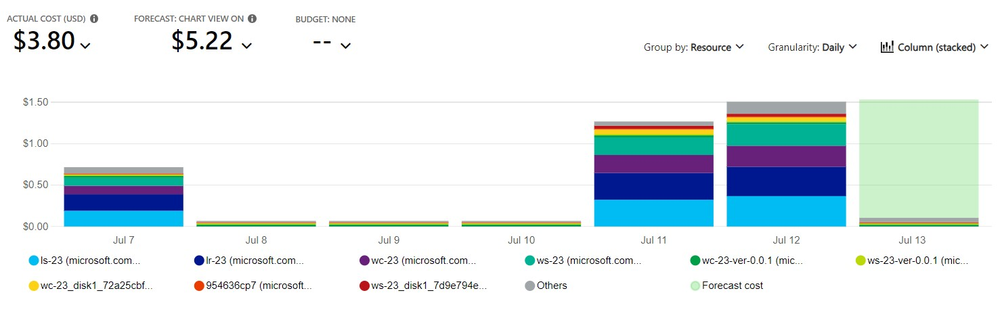

# Checkpoint8 Submission

- **COURSE INFORMATION: CSN400NAA-2234**
- **STUDENT’S NAME: Parav Gagneja**
- **STUDENT'S NUMBER: 104415211**
- **GITHUB USER ID: 104415211-myseneca**
- **TEACHER’S NAME: Atoosa Nasiri**

### Table of Contents

- [Checkpoint8 Submission](#checkpoint8-submission)
    - [Table of Contents](#table-of-contents)
    - [Part A - Creating \& Configuring VMs - Using Azure CLI Scripts](#part-a---creating--configuring-vms---using-azure-cli-scripts)
    - [Part B - Basic Connectivity - Linux VMs Firewall Setting](#part-b---basic-connectivity---linux-vms-firewall-setting)
    - [Part C - Azure Cost Analysis Charts](#part-c---azure-cost-analysis-charts)

### Part A - Creating & Configuring VMs - Using Azure CLI Scripts

1. List of VM, NSG, NIC, and Disks:
``` bash
Virtual Machines(VM):

odl_user [ ~ ]$ az vm list --output table
Name    ResourceGroup      Location    Zones
------  -----------------  ----------  -------
LR-23   STUDENT-RG-954636  canadaeast
LS-23   STUDENT-RG-954636  canadaeast
WC-23   STUDENT-RG-954636  canadaeast
WS-23   STUDENT-RG-954636  canadaeast
```

``` bash
Network Security Groups(NSG):

odl_user [ ~ ]$ az network nsg list --output table
Location    Name        ProvisioningState    ResourceGroup      ResourceGuid
----------  ----------  -------------------  -----------------  ------------------------------------
canadaeast  LR-23-nsg   Succeeded            Student-RG-954636  b7436afb-8d2f-4e3e-9e99-2dcd7f3ec741
canadaeast  LR-NSG-23   Succeeded            Student-RG-954636  c0d34bc2-5b2a-4106-b74a-58680573895c
canadaeast  LR23nsg219  Succeeded            Student-RG-954636  a0f79daa-ae03-4b73-9dbb-df6ee737a5bf
canadaeast  LR23nsg295  Succeeded            Student-RG-954636  ae30bb74-52bd-4059-91b6-a188f0338018
canadaeast  LS-23-nsg   Succeeded            Student-RG-954636  7a7b906f-b055-4d19-a338-ab13db64e466
canadaeast  LS-NSG-23   Succeeded            Student-RG-954636  227f2a65-e6e8-4a39-868d-02b30c71698a
canadaeast  LS23nsg778  Succeeded            Student-RG-954636  3471256f-a515-4488-bb09-c448c4eb24b3
canadaeast  WC-23-nsg   Succeeded            Student-RG-954636  35e925e7-1052-4846-bc62-b861c66fbc3e
canadaeast  WC-NSG-23   Succeeded            Student-RG-954636  1197b518-9e42-4504-86b1-ef2048a3f949
canadaeast  WC23nsg958  Succeeded            Student-RG-954636  38344582-fc8c-49f8-ba61-77635d199e56
canadaeast  WS-23-nsg   Succeeded            Student-RG-954636  dea74b96-6f32-40af-af84-37ff2b8b5ad6
canadaeast  WS-NSG-23   Succeeded            Student-RG-954636  15465c85-3bd0-43c6-84d2-542553e487b3
canadaeast  WS23nsg697  Succeeded            Student-RG-954636  0c8f8fd3-746e-4909-8d1b-4af9a67aa680
```

``` bash
Network Interface Cards(NIC):

odl_user [ ~ ]$ az network nic list --output table
EnableAcceleratedNetworking    EnableIPForwarding    Location    MacAddress         Name    NicType    Primary    ProvisioningState    ResourceGroup      ResourceGuid                          VnetEncryptionSupported
-----------------------------  --------------------  ----------  -----------------  ------  ---------  ---------  -------------------  -----------------  ------------------------------------  -------------------------
False                          True                  canadaeast  00-0D-3A-0A-2B-F0  lr-23   Standard   True       Succeeded            Student-RG-954636  8757930c-09ce-48b8-a7e2-68a0a06da9f3  False
False                          False                 canadaeast  00-0D-3A-F4-5E-A1  ls-23   Standard   True       Succeeded            Student-RG-954636  a48629e8-5677-4ca7-9ee1-84849bc83597  False
False                          False                 canadaeast  00-0D-3A-F4-1B-0B  wc-23   Standard   True       Succeeded            Student-RG-954636  b5902ac8-49f6-4d73-9d12-0710dc6df62b  False
False                          False                 canadaeast  00-0D-3A-0A-04-B8  ws-23   Standard   True       Succeeded            Student-RG-954636  45047444-a063-4dca-8ba2-62d30d165a77  False
```

``` bash
Disks:

odl_user [ ~ ]$ az disk list --output table
Name                                          ResourceGroup      Location    Zones    Sku              OsType    SizeGb    ProvisioningState
--------------------------------------------  -----------------  ----------  -------  ---------------  --------  --------  -------------------
LR-23_disk1_17cd7051205649c6aff24e05e75419b6  STUDENT-RG-954636  canadaeast           StandardSSD_LRS  Linux     64        Succeeded
LS-23_disk1_36bcd672aa8c46b190ba8e59710e8623  STUDENT-RG-954636  canadaeast           StandardSSD_LRS  Linux     64        Succeeded
WC-23_disk1_72a25cbf85324260a8149f734f622536  STUDENT-RG-954636  canadaeast           StandardSSD_LRS  Windows   127       Succeeded
WS-23_disk1_7d9e794e6d264abfaab0b0b52f7fb0fd  STUDENT-RG-954636  canadaeast           StandardSSD_LRS  Windows   127       Succeeded
```
2. We created NIC's seprate from virtual machines because we need them later on, if we create NIC's with VM's so when deleting VM's it will delete NIC's too. So when we deleted VM's using the scripts it gave us a prompt displaying "Do you want to delete NIC" where we answered so to keep NIC's safe.
  
3. <b>Rules added in NSG:</b>
   
`declare -a NSG_list=("$WC_NSG_name" "$LR_NSG_name" "$LS_NSG_name" "$WS_NSG_name")`

5. <b>list of all custom images:</b>

``` bash
odl_user [ ~ ]$ az image list --output table
HyperVGeneration    Location    Name             ProvisioningState    ResourceGroup
------------------  ----------  ---------------  -------------------  -----------------
V2                  canadaeast  lr-23-ver-0.0.1  Succeeded            STUDENT-RG-954636
V2                  canadaeast  lr-23-ver-7      Succeeded            STUDENT-RG-954636
V2                  canadaeast  ls-23-ver-0.0.1  Succeeded            STUDENT-RG-954636
V2                  canadaeast  ls-23-ver-7      Succeeded            STUDENT-RG-954636
V2                  canadaeast  wc-23-ver-0.0.1  Succeeded            STUDENT-RG-954636
V2                  canadaeast  wc-23-ver-7      Succeeded            STUDENT-RG-954636
V2                  canadaeast  ws-23-ver-0.0.1  Succeeded            STUDENT-RG-954636
V2                  canadaeast  ws-23-ver-7      Succeeded            STUDENT-RG-954636
```
6. List of all the VMs after deleting all virtual machines:
``` bash
odl_user [ ~ ]$ az vm list 
[]
odl_user [ 
```

7. list of VM, NSG, NIC, and Disks using Azure CLI in table format:
``` bash
VM:

odl_user [ ~ ]$ az vm list --output table

odl_user [ ~ ]$ 
```

``` bash
NSG:

odl_user [ ~ ]$ az network nsg list --output table
Location    Name        ProvisioningState    ResourceGroup      ResourceGuid
----------  ----------  -------------------  -----------------  ------------------------------------
canadaeast  LR-23-nsg   Succeeded            Student-RG-954636  b7436afb-8d2f-4e3e-9e99-2dcd7f3ec741
canadaeast  LR-NSG-23   Succeeded            Student-RG-954636  c0d34bc2-5b2a-4106-b74a-58680573895c
canadaeast  LR23nsg219  Succeeded            Student-RG-954636  a0f79daa-ae03-4b73-9dbb-df6ee737a5bf
canadaeast  LR23nsg295  Succeeded            Student-RG-954636  ae30bb74-52bd-4059-91b6-a188f0338018
canadaeast  LS-23-nsg   Succeeded            Student-RG-954636  7a7b906f-b055-4d19-a338-ab13db64e466
canadaeast  LS-NSG-23   Succeeded            Student-RG-954636  227f2a65-e6e8-4a39-868d-02b30c71698a
canadaeast  LS23nsg778  Succeeded            Student-RG-954636  3471256f-a515-4488-bb09-c448c4eb24b3
canadaeast  WC-23-nsg   Succeeded            Student-RG-954636  35e925e7-1052-4846-bc62-b861c66fbc3e
canadaeast  WC-NSG-23   Succeeded            Student-RG-954636  1197b518-9e42-4504-86b1-ef2048a3f949
canadaeast  WC23nsg958  Succeeded            Student-RG-954636  38344582-fc8c-49f8-ba61-77635d199e56
canadaeast  WS-23-nsg   Succeeded            Student-RG-954636  dea74b96-6f32-40af-af84-37ff2b8b5ad6
canadaeast  WS-NSG-23   Succeeded            Student-RG-954636  15465c85-3bd0-43c6-84d2-542553e487b3
canadaeast  WS23nsg697  Succeeded            Student-RG-954636  0c8f8fd3-746e-4909-8d1b-4af9a67aa680
```

``` bash
NIC:

odl_user [ ~ ]$ az network nic list --output table
EnableAcceleratedNetworking    EnableIPForwarding    Location    MacAddress         Name    NicType    ProvisioningState    ResourceGroup      ResourceGuid                          VnetEncryptionSupported
-----------------------------  --------------------  ----------  -----------------  ------  ---------  -------------------  -----------------  ------------------------------------  -------------------------
False                          True                  canadaeast  00-0D-3A-0A-2B-F0  lr-23   Standard   Succeeded            Student-RG-954636  8757930c-09ce-48b8-a7e2-68a0a06da9f3  False
False                          False                 canadaeast  00-0D-3A-F4-5E-A1  ls-23   Standard   Succeeded            Student-RG-954636  a48629e8-5677-4ca7-9ee1-84849bc83597  False
False                          False                 canadaeast  00-0D-3A-F4-1B-0B  wc-23   Standard   Succeeded            Student-RG-954636  b5902ac8-49f6-4d73-9d12-0710dc6df62b  False
False                          False                 canadaeast  00-0D-3A-0A-04-B8  ws-23   Standard   Succeeded            Student-RG-954636  45047444-a063-4dca-8ba2-62d30d165a77  False
```

``` bash
Disks:

odl_user [ ~ ]$ az disk list --output table

odl_user [ ~ ]$ 
```


### Part B - Basic Connectivity - Linux VMs Firewall Setting

1. <b>Status of the Apache server and MariDB server in your LS-23</b>

Apache:
``` bash
[pgagneja@LS-23 ~]$ sudo systemctl status apache2
Unit apache2.service could not be found.
```

MariDB:
``` bash
[pgagneja@LS-23 ~]$ sudo systemctl status mariadb
Unit mariadb.service could not be found.
```
2. <b>Command in LR-23 that show iptables chains</b>
``` bash
[pgagneja@LR-23 ~]$ sudo iptables -L
Chain INPUT (policy ACCEPT)
target     prot opt source               destination
ACCEPT     tcp  --  anywhere             anywhere             state RELATED,ESTABLISHED
ACCEPT     icmp --  anywhere             anywhere
ACCEPT     all  --  anywhere             anywhere
ACCEPT     tcp  --  10.36.199.0/24       anywhere             state NEW tcp dpt:ssh
LOG        all  --  anywhere             anywhere             limit: avg 10/sec burst 5 LOG level warning prefix "TO_DROP_INPUT"
DROP       all  --  anywhere             anywhere

Chain FORWARD (policy ACCEPT)
target     prot opt source               destination
ACCEPT     tcp  --  10.36.199.0/24       172.17.23.32/27      tcp dpt:ssh
ACCEPT     tcp  --  172.17.23.32/27      10.36.199.0/24       tcp spt:ssh
ACCEPT     tcp  --  10.36.199.0/24       172.17.23.32/27      tcp dpt:ms-wbt-server
ACCEPT     tcp  --  172.17.23.32/27      10.36.199.0/24       tcp spt:ms-wbt-server
LOG        all  --  anywhere             anywhere             limit: avg 10/sec burst 5 LOG level warning prefix "TO_DROP_FORWARD"
DROP       all  --  anywhere             anywhere

Chain OUTPUT (policy ACCEPT)
target     prot opt source               destination
ACCEPT     all  --  anywhere             anywhere
```
``` bash

System security can be improved by restricting connections, by applying REJECT or DROP policy or and using NSG.
```
3. <b>Hostname</b>
``` bash
LR-23

[pgagneja@LR-23 ~]$ sudo hostnamectl status
   Static hostname: LR-23.CSN4002234.com
         Icon name: computer-vm
           Chassis: vm
        Machine ID: c30654a8e7de4cd68b942774c4e1ccca
           Boot ID: e863d36737a64831979e86dca593414d
    Virtualization: microsoft
  Operating System: Red Hat Enterprise Linux 8.8 (Ootpa)
       CPE OS Name: cpe:/o:redhat:enterprise_linux:8::baseos
            Kernel: Linux 4.18.0-477.10.1.el8_8.x86_64
      Architecture: x86-64
```

``` bash
LS-23

[pgagneja@LS-23 ~]$ sudo hostnamectl status
   Static hostname: LS-23.CSN4002234.com
         Icon name: computer-vm
           Chassis: vm
        Machine ID: c30654a8e7de4cd68b942774c4e1ccca
           Boot ID: e9cbfc10a477433da70d35c82d47acc6
    Virtualization: microsoft
  Operating System: Red Hat Enterprise Linux 8.8 (Ootpa)
       CPE OS Name: cpe:/o:redhat:enterprise_linux:8::baseos
            Kernel: Linux 4.18.0-477.10.1.el8_8.x86_64
      Architecture: x86-64
```

4. <b>lr_iptables.txt</b>
``` bash
[pgagneja@LR-23 ~]$ sudo iptables -nvL
Chain INPUT (policy ACCEPT 0 packets, 0 bytes)
 pkts bytes target     prot opt in     out     source               destination
 8424 1618K ACCEPT     tcp  --  *      *       0.0.0.0/0            0.0.0.0/0            state RELATED,ESTABLISHED
    4   240 ACCEPT     icmp --  *      *       0.0.0.0/0            0.0.0.0/0
    0     0 ACCEPT     all  --  lo     *       0.0.0.0/0            0.0.0.0/0
    3   156 ACCEPT     tcp  --  *      *       10.36.199.0/24       0.0.0.0/0            state NEW tcp dpt:22
  175 33392 LOG        all  --  *      *       0.0.0.0/0            0.0.0.0/0            limit: avg 10/sec burst 5 LOG flags 0 level 4 prefix "TO_DROP_INPUT"
  175 33392 DROP       all  --  *      *       0.0.0.0/0            0.0.0.0/0

Chain FORWARD (policy ACCEPT 0 packets, 0 bytes)
 pkts bytes target     prot opt in     out     source               destination
   58  5845 ACCEPT     tcp  --  *      *       10.36.199.0/24       172.17.23.32/27      tcp dpt:22
   51  7673 ACCEPT     tcp  --  *      *       172.17.23.32/27      10.36.199.0/24       tcp spt:22
  532 44580 ACCEPT     tcp  --  *      *       10.36.199.0/24       172.17.23.32/27      tcp dpt:3389
  528 74448 ACCEPT     tcp  --  *      *       172.17.23.32/27      10.36.199.0/24       tcp spt:3389
    3  3780 LOG        all  --  *      *       0.0.0.0/0            0.0.0.0/0            limit: avg 10/sec burst 5 LOG flags 0 level 4 prefix "TO_DROP_FORWARD"
    3  3780 DROP       all  --  *      *       0.0.0.0/0            0.0.0.0/0

Chain OUTPUT (policy ACCEPT 0 packets, 0 bytes)
 pkts bytes target     prot opt in     out     source               destination
11141 2447K ACCEPT     all  --  *      *       0.0.0.0/0            0.0.0.0/0
```

<b>ls_iptables.txt</b>
``` bash
[pgagneja@LS-23 ~]$ sudo iptables -nvL
Chain INPUT (policy ACCEPT 0 packets, 0 bytes)
 pkts bytes target     prot opt in     out     source               destination
 6384 1449K ACCEPT     tcp  --  *      *       0.0.0.0/0            0.0.0.0/0            state RELATED,ESTABLISHED
    0     0 ACCEPT     icmp --  *      *       0.0.0.0/0            0.0.0.0/0
    0     0 ACCEPT     all  --  lo     *       0.0.0.0/0            0.0.0.0/0
    0     0 ACCEPT     tcp  --  *      *       192.168.23.32/27     0.0.0.0/0            tcp dpt:22
    1    52 ACCEPT     tcp  --  *      *       10.36.199.0/24       0.0.0.0/0            tcp dpt:22
  181 32123 LOG        all  --  *      *       0.0.0.0/0            0.0.0.0/0            limit: avg 10/sec burst 5 LOG flags 0 level 4 prefix "TO_DROP_INPUT"
  181 32123 DROP       all  --  *      *       0.0.0.0/0            0.0.0.0/0

Chain FORWARD (policy ACCEPT 0 packets, 0 bytes)
 pkts bytes target     prot opt in     out     source               destination
    0     0 DROP       all  --  *      *       0.0.0.0/0            0.0.0.0/0

Chain OUTPUT (policy ACCEPT 0 packets, 0 bytes)
 pkts bytes target     prot opt in     out     source               destination
 8834 2122K ACCEPT     all  --  *      *       0.0.0.0/0            0.0.0.0/0
```

5. <b>SSH to LS-23</b>


<b>RDP to WS-23</b>


### Part C - Azure Cost Analysis Charts

| No. | Scope | Chart Type | VIEW Type |  Date Range | Group By | Granularity| Example |
|-|-|-|-|-|-|-|-|
|1|Student-RG-954636| Column (Stacked) | DailyCosts | Last 7 Days | Resource | Daily |  |
|2|Student-RG-954636| Column (Stacked) | DailyCosts | Last 7 Days | Service | Daily |  |
|3|Student-RG-954636| Area| AccumulatedCosts | Last 7 Days | Resource | Accumulated |  |
|4|Student-RG-954636| Pie Chart | NA | Last Month | Service Name | NA |  |
|5|Student-RG-954636| Pie Chart | NA | Last Month | Service Family | NA |  |
|6|Student-RG-954636| Pie Chart | NA | Last Month | Product | NA |  |

<br>

<b>Customized Dashboard</b>

