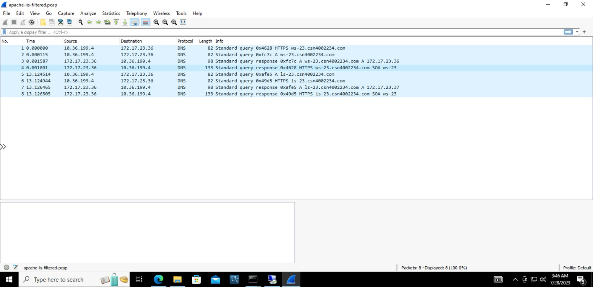
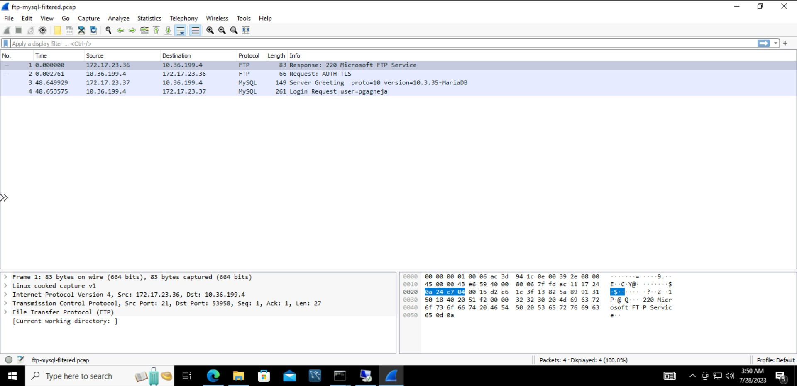
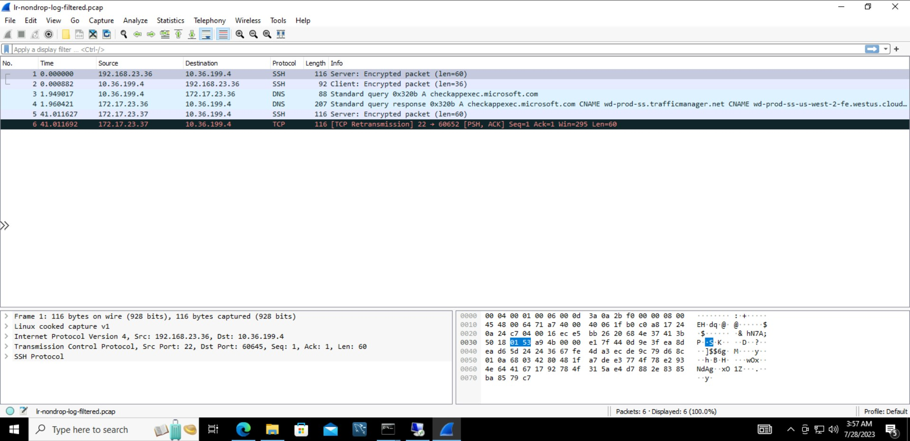

# Checkpoint9 Submission

- **COURSE INFORMATION: CSN400NAA-2234**
- **STUDENT’S NAME: Parav Gagneja**
- **STUDENT'S NUMBER: 104415211**
- **GITHUB USER ID: 104415211-myseneca**
- **TEACHER’S NAME: Atoosa Nasiri**

### Table of Contents

- [Checkpoint9 Submission](#checkpoint9-submission)
    - [Table of Contents](#table-of-contents)
    - [Part A – Logging and Analyzing DNS and HTTP Traffic](#part-a--logging-and-analyzing-dns-and-http-traffic)
    - [Part B – Logging and Analyzing FTP and MySQL Traffic](#part-b--logging-and-analyzing-ftp-and-mysql-traffic)
    - [Part C – Adjusting firewalls to DROP and LOG Traffic](#part-c--adjusting-firewalls-to-drop-and-log-traffic)
    - [Part D - Azure Cost Analysis Charts](#part-d---azure-cost-analysis-charts)

### Part A – Logging and Analyzing DNS and HTTP Traffic




### Part B – Logging and Analyzing FTP and MySQL Traffic



### Part C – Adjusting firewalls to DROP and LOG Traffic

``` bash

Jul 28 03:37:21 LR-23 kernel: IN=eth0 OUT=eth0 MAC=00:0d:3a:0a:2b:f0:ac:3d:94:1c:0e:00:08:00 SRC=10.36.199.4 DST=172.17.23.36 LEN=40 TOS=0x00 PREC=0x00 TTL=127 ID=54976 DF PROTO=TCP SPT=54228 DPT=3389 WINDOW=2047 RES=0x00 ACK URGP=0

Jul 28 03:23:17 LR-23 kernel: IN=eth0 OUT=eth0 MAC=00:0d:3a:0a:2b:f0:ac:3d:94:1c:0e:00:08:00 SRC=10.36.199.4 DST=172.17.23.37 LEN=52 TOS=0x00 PREC=0x00 TTL=127 ID=41908 DF PROTO=TCP SPT=54409 DPT=22 WINDOW=64240 RES=0x00 SYN URGP=0

```




### Part D - Azure Cost Analysis Charts