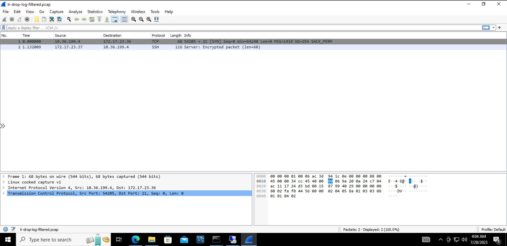
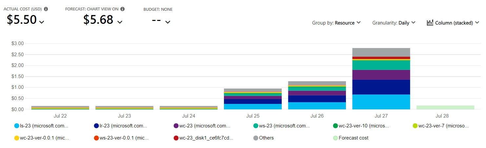
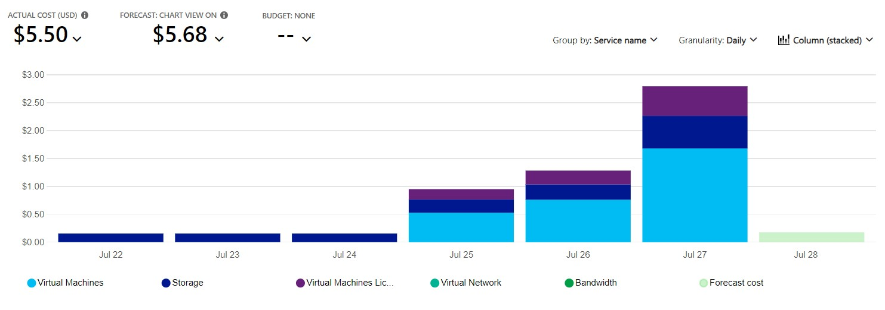
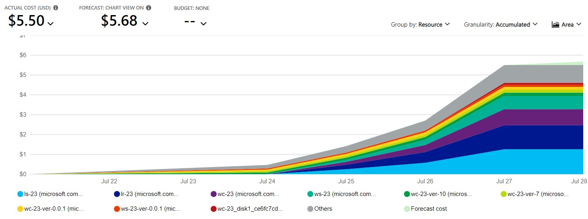
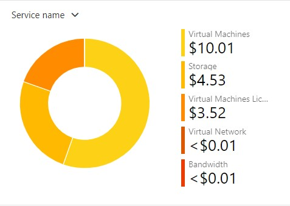
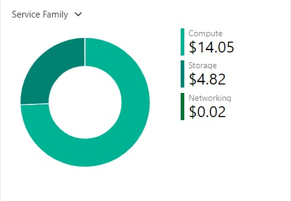
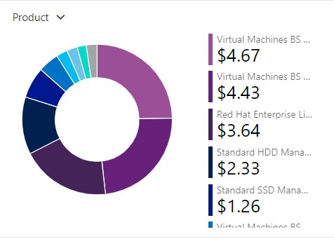

# Checkpoint9 Submission

- **COURSE INFORMATION: CSN400NAA-2234**
- **STUDENT’S NAME: Parav Gagneja**
- **STUDENT'S NUMBER: 104415211**
- **GITHUB USER ID: 104415211-myseneca**
- **TEACHER’S NAME: Atoosa Nasiri**

### Table of Contents

- [Checkpoint9 Submission](#checkpoint9-submission)
    - [Table of Contents](#table-of-contents)
    - [Part A – Logging and Analyzing DNS and HTTP Traffic](#part-a--logging-and-analyzing-dns-and-http-traffic)
    - [Part B – Logging and Analyzing FTP and MySQL Traffic](#part-b--logging-and-analyzing-ftp-and-mysql-traffic)
    - [Part C – Adjusting firewalls to DROP and LOG Traffic](#part-c--adjusting-firewalls-to-drop-and-log-traffic)
    - [Part D - Azure Cost Analysis Charts](#part-d---azure-cost-analysis-charts)

<br>

### Part A – Logging and Analyzing DNS and HTTP Traffic

<br>


<br>

### Part B – Logging and Analyzing FTP and MySQL Traffic
<br>


<br>

### Part C – Adjusting firewalls to DROP and LOG Traffic
<br>
``` bash
[pgagneja@LR-23 ~]$ cat lr-drop-log.sh
# Flush All Iptables Chains/Firewall rules
echo "-------------------------------------------"
echo "Flush All Iptables Chains/Firewall rules"
iptables -F

# Delete all Iptables Chains
echo "-------------------------------------------"
echo "Delete all Iptables Chains"
iptables -X

# Allow any INPUT tcp traffic if RELATED or ESTABLISHED
echo "-------------------------------------------"
echo "Allow any INPUT tcp traffic if RELATED or ESTABLISHED"
iptables -A INPUT -p tcp -m state --state RELATED,ESTABLISHED -j ACCEPT

# Allow icmp traffic into the VM
echo "-------------------------------------------"
echo "Allow icmp traffic into the VM"
iptables -A INPUT -p icmp -j ACCEPT

# Allow any traffic from loopback interface into the VM
echo "-------------------------------------------"
echo "Allow any traffic from loopback interface into the VM"
iptables -A INPUT -i lo -j ACCEPT

# Allow all SSH traffic on port 22 from Source IP subnet student_vnet
echo "-------------------------------------------"
echo "Allow all SSH traffic on port 22 from Source IP subnet student_vnet"
iptables -A INPUT -p tcp -s 10.36.199.0/24 -m state --state NEW --dport 22 -j ACCEPT

# Log before DROPPING
echo "-------------------------------------------"
echo "Add a rule to LOG instead of DROPPING INPUT packets"
iptables -A INPUT -p all -m limit --limit 10/s -j LOG  --log-prefix "TO_DROP_INPUT"

# Reject all other INPUT traffic
# echo "-------------------------------------------"
# echo "Reject all other INPUT traffic"
iptables -A INPUT -j DROP

iptables -I FORWARD -p tcp -j LOG
iptables -I FORWARD -p udp -j LOG

iptables -A FORWARD -p tcp -s 10.36.199.4 -d 172.17.23.36 --dport 21 -j DROP
iptables -A FORWARD -p tcp -s 10.36.199.0/24 -d 172.17.23.37 --dport 22 -j DROP


echo "-------------------------------------------"
echo "DNS"
echo "allow any tcp and udp traffic pass through Linux router for DNS protocol"
iptables -A FORWARD -p tcp -d 172.17.23.36 --dport 53 -j ACCEPT
iptables -A FORWARD -p tcp -s 172.17.23.36 --sport 53 -j ACCEPT
iptables -A FORWARD -p udp -d 172.17.23.36 --dport 53 -j ACCEPT
iptables -A FORWARD -p udp -s 172.17.23.36 --sport 53 -j ACCEPT

# Allow forwarding SSH traffic on port 22 from Windows Client to Server SN1
echo "-------------------------------------------"
echo "SSH"
echo "Allow forwarding all SSH traffic on port 22 from any source to any destination"
iptables -A FORWARD -p tcp -s 10.36.199.0/24 -d 172.17.23.32/27 --dport 22 -j ACCEPT
iptables -A FORWARD -p tcp -s 172.17.23.32/27 -d 10.36.199.0/24 --sport 22 -j ACCEPT


# Allow forwarding RDP traffic on port 3389 from from Windows Client to Server SN1
echo "-------------------------------------------"
echo "RDP"
echo "Allow forwarding all RDP traffic on port 3389 from any source to any destination"
iptables -A FORWARD -p tcp -s 10.36.199.0/24 -d 172.17.23.32/27 --dport 3389 -j ACCEPT
iptables -A FORWARD -p tcp -s 172.17.23.32/27 -d 10.36.199.0/24 --sport 3389 -j ACCEPT

# Log before DROPPING
echo "-------------------------------------------"
echo "Add a rule to LOG instead of DROPPING FORWARD packets"
iptables -A FORWARD -p all -m limit --limit 10/s -j LOG --log-prefix "TO_DROP_FORWARD"

# Reject all other FORWARD traffic from this machine
# echo "-------------------------------------------"
# echo "Reject all other FORWARD traffic from this machine"
iptables -A FORWARD -j DROP

# Allow all output traffic from this machine
echo "-------------------------------------------"
echo "Allow all output traffic from this machine"
iptables -A OUTPUT -j ACCEPT

# List current iptables status
echo "-------------------------------------------"
echo "list current iptables status"
iptables -nvL --line-number

echo "-------------------------------------------"
echo "MySQL"
echo "allow any tcp traffic pass through Source WC-xx subnet to Destination LS-xx for destination MySQL protocol"
iptables -A FORWARD -p tcp -s 10.36.199.4/24 -d 172.17.23.37 --dport 3306 -j ACCEPT
echo "allow any tcp traffic pass through Source WS-xx to destination WC-xx subnet for source MySQL protocol"
iptables -A FORWARD -p tcp -d 10.36.199.4/24 -s 172.17.23.37 --sport 3306 -j ACCEPT

echo "-------------------------------------------"
echo "Apache"
echo "allow any tcp traffic pass through Source WC-xx subnet to Destination WS-xx for destination Apache protocol"
iptables -A FORWARD -p tcp -s 10.36.199.4/24 -d 172.17.23.37 --dport 80 -j ACCEPT
echo "allow any tcp traffic pass through Source WS-xx to destination WC-xx subnet for source Apache protocol"
iptables -A FORWARD -p tcp -d 10.36.199.4/24 -s 172.17.23.37 --sport 80 -j ACCEPT

echo "-------------------------------------------"
echo "IIS"
echo "allow any tcp traffic pass through Source WC-xx subnet to Destination LR-xx for destination HTTP protocol to access IIS"
iptables -A FORWARD -p tcp -s 10.36.199.4/24 -d 172.17.23.36 --dport 80 -j ACCEPT
echo "allow any tcp traffic pass through Source LS-xx to destination WC-xx subnet for source HTTP protocol to access IIS"
iptables -A FORWARD -p tcp -d 10.36.199.4/24 -s 172.17.23.36 --sport 80 -j ACCEPT

echo "-------------------------------------------"
echo "FTP Administration Port"
echo "allow any tcp traffic pass through Source WC-xx subnet to Destination LR-xx for destination FTP protocol"
iptables -A FORWARD -p tcp -s 10.36.199.4/24 -d 172.17.23.36 --dport 21 -j ACCEPT
echo "allow any tcp traffic pass through Source LS-xx to destination WC-xx subnet for source FTP protocol"
iptables -A FORWARD -p tcp -d 10.36.199.4/24 -s 172.17.23.36 --sport 21 -j ACCEPT

echo "-------------------------------------------"
echo "FTP DATA Port"
echo "allow any tcp traffic pass through Source WC-xx subnet to Destination LR-xx for destination FTP protocol"
iptables -A FORWARD -p tcp -s 10.36.199.4/24 -d 172.17.23.36 --dport 50000:51000 -j ACCEPT
echo "allow any tcp traffic pass through Source LS -xx to destination WC-xx subnet for source FTP protocol"
iptables -A FORWARD -p tcp -d 10.36.199.4/24 -s 172.17.23.36 --sport 50000:51000 -j ACCEPT

```
<br>


<br>

``` bash

Jul 28 03:37:21 LR-23 kernel: IN=eth0 OUT=eth0 MAC=00:0d:3a:0a:2b:f0:ac:3d:94:1c:0e:00:08:00 SRC=10.36.199.4 DST=172.17.23.36 LEN=40 TOS=0x00 PREC=0x00 TTL=127 ID=54976 DF PROTO=TCP SPT=54228 DPT=3389 WINDOW=2047 RES=0x00 ACK URGP=0

Jul 28 03:23:17 LR-23 kernel: IN=eth0 OUT=eth0 MAC=00:0d:3a:0a:2b:f0:ac:3d:94:1c:0e:00:08:00 SRC=10.36.199.4 DST=172.17.23.37 LEN=52 TOS=0x00 PREC=0x00 TTL=127 ID=41908 DF PROTO=TCP SPT=54409 DPT=22 WINDOW=64240 RES=0x00 SYN URGP=0

```
<br>



### Part D - Azure Cost Analysis Charts

| No. | Scope | Chart Type | VIEW Type |  Date Range | Group By | Granularity| Example |
|-|-|-|-|-|-|-|-|
|1|Student-RG-954636| Column (Stacked) | DailyCosts | Last 7 Days | Resource | Daily |  |
|2|Student-RG-954636| Column (Stacked) | DailyCosts | Last 7 Days | Service | Daily |  |
|3|Student-RG-954636| Area| AccumulatedCosts | Last 7 Days | Resource | Accumulated |  |
|4|Student-RG-954636| Pie Chart | NA | Last Month | Service Name | NA |  |
|5|Student-RG-954636| Pie Chart | NA | Last Month | Service Family | NA |  |
|6|Student-RG-954636| Pie Chart | NA | Last Month | Product | NA |  |