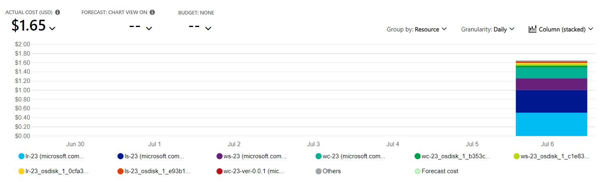
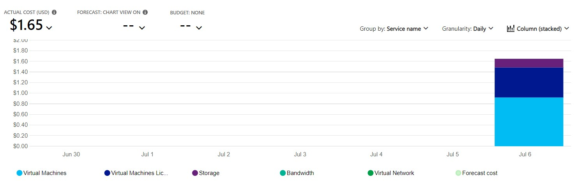
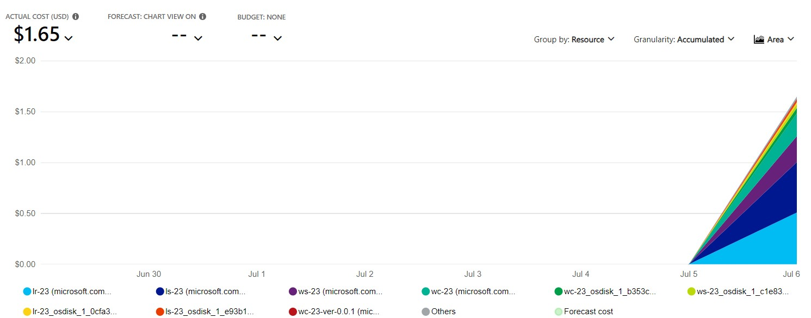
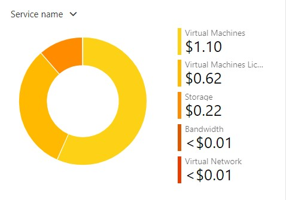
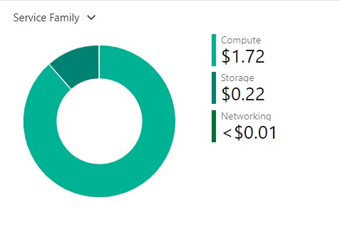
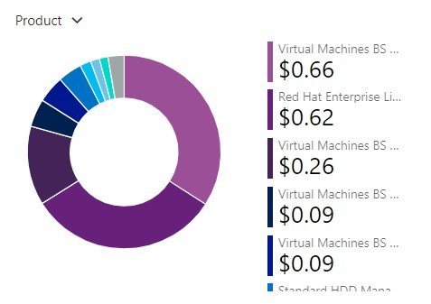
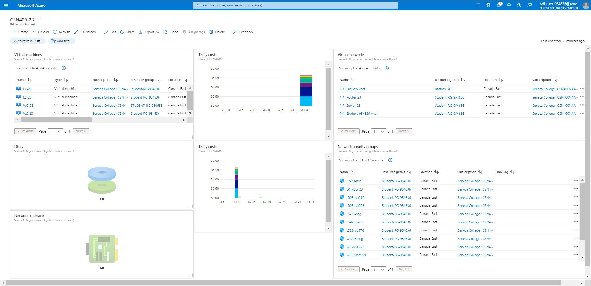

# Checkpoint7 Submission

- **COURSE INFORMATION: CSN400NAA-2234**
- **STUDENT’S NAME: Parav Gagneja**
- **STUDENT'S NUMBER: 104415211**
- **GITHUB USER ID: 104415211-myseneca**
- **TEACHER’S NAME: Atoosa Nasiri**

### Table of Contents

- [Checkpoint7 Submission](#checkpoint7-submission)
    - [Table of Contents](#table-of-contents)
    - [Part A - Creating \& Configuring VMs - Using Portal](#part-a---creating--configuring-vms---using-portal)
    - [Part B - Basic Connectivity - VM Configuration](#part-b---basic-connectivity---vm-configuration)
    - [Part C - Basic Connectivity - VM Configuration](#part-c---basic-connectivity---vm-configuration)
    - [Part E - Azure Cost Analysis Charts](#part-e---azure-cost-analysis-charts)
    - [Part F - Create Customized Azure Dashboard](#part-f---create-customized-azure-dashboard)

### Part A - Creating & Configuring VMs - Using Portal

1.  Difference between Windows machine NSG and Linux machine NSG rules is in protocols.
   we typically need rule for RDP but for ssh we need NSG rule. if we delete specific ssh and rdp rule then the connection would 
   not remain established.


``` bash
2.az group list -out table


odl_user [ ~ ]$ az group list --output table
Name               Location    Status
-----------------  ----------  ---------
Bastion_RG         canadaeast  Succeeded
NetworkWatcherRG   canadaeast  Succeeded
Student-RG-954636  canadaeast  Succeeded
```
``` bash
az vm list -g $RG -o table


odl_user [ ~ ]$ az vm list -g $RG -o table
Name    ResourceGroup      Location    Zones
------  -----------------  ----------  -------
LR-23   Student-RG-954636  canadaeast
LS-23   Student-RG-954636  canadaeast
WC-23   Student-RG-954636  canadaeast
WS-23   Student-RG-954636  canadaeast
```
``` bash
az network nic list -g $RG -o table


odl_user [ ~ ]$ az network nic list -g $RG -o table
EnableAcceleratedNetworking    EnableIPForwarding    Location    MacAddress         Name      NicType    Primary    ProvisioningState    ResourceGroup      ResourceGuid                          VnetEncryptionSupported
-----------------------------  --------------------  ----------  -----------------  --------  ---------  ---------  -------------------  -----------------  ------------------------------------  -------------------------
False                          False                 canadaeast  00-22-48-6E-1F-41  lr-23458  Standard   True       Succeeded            Student-RG-954636  c1274639-3f6d-471d-b538-3a10e916b819  False
False                          False                 canadaeast  00-22-48-6D-86-86  ls-23715  Standard   True       Succeeded            Student-RG-954636  68598b8d-8b12-42e5-b2e0-6c7c6c4f4226  False
False                          False                 canadaeast  00-0D-3A-F4-2A-D1  wc-232    Standard   True       Succeeded            Student-RG-954636  534e577c-6411-434f-a939-5ec751aa2aa9  False
False                          False                 canadaeast  00-22-48-D5-68-9A  ws-2323   Standard   True       Succeeded            Student-RG-954636  81654821-97c9-426b-ba81-c49e39c99616  False
```
``` bash
az network nsg list -g $RG -o table


odl_user [ ~ ]$ az network nsg list -g $RG  -o table
Location    Name       ProvisioningState    ResourceGroup      ResourceGuid
----------  ---------  -------------------  -----------------  ------------------------------------
canadaeast  LR-23-nsg  Succeeded            Student-RG-954636  b7436afb-8d2f-4e3e-9e99-2dcd7f3ec741
canadaeast  LR-NSG-23  Succeeded            Student-RG-954636  c0d34bc2-5b2a-4106-b74a-58680573895c
canadaeast  LS-23-nsg  Succeeded            Student-RG-954636  7a7b906f-b055-4d19-a338-ab13db64e466
canadaeast  LS-NSG-23  Succeeded            Student-RG-954636  227f2a65-e6e8-4a39-868d-02b30c71698a
canadaeast  WC-23-nsg  Succeeded            Student-RG-954636  35e925e7-1052-4846-bc62-b861c66fbc3e
canadaeast  WC-NSG-23  Succeeded            Student-RG-954636  1197b518-9e42-4504-86b1-ef2048a3f949
canadaeast  WS-23-nsg  Succeeded            Student-RG-954636  dea74b96-6f32-40af-af84-37ff2b8b5ad6
canadaeast  WS-NSG-23  Succeeded            Student-RG-954636  15465c85-3bd0-43c6-84d2-542553e487b3
```
``` bash
az disk list -g $RG -o table


odl_user [ ~ ]$ az disk list -g $RG -o table
Name                                             ResourceGroup      Location    Zones    Sku           OsType    SizeGb    ProvisioningState
-----------------------------------------------  -----------------  ----------  -------  ------------  --------  --------  -------------------
LR-23_OsDisk_1_0cfa3fd6a27b4d4bafbea943e71c16c3  Student-RG-954636  canadaeast           Standard_LRS  Linux     64        Succeeded
LS-23_OsDisk_1_e93b13dd6b9e4944bdfedc6816aad565  Student-RG-954636  canadaeast           Standard_LRS  Linux     64        Succeeded
WC-23_OsDisk_1_b353ce51fa7f4c88a06f6d3673d177ed  Student-RG-954636  canadaeast           Standard_LRS  Windows   127       Succeeded
WS-23_OsDisk_1_c1e83f32a3e74c3c83e615162b51c3dd  Student-RG-954636  canadaeast           Standard_LRS  Windows   127       Succeeded
```

### Part B - Basic Connectivity - VM Configuration
``` bash
1.az network nic ip-config show -g Student-RG-954636 -n ipconfig1 --nic-name lr-23458 --query "IpForwarding"


odl_user [ ~ ]$ az network nic ip-config show -g Student-RG-954636 -n ipconfig1 --nic-name lr-23458
{
  "etag": "W/\"2031c632-315c-442f-94b1-2bbc821805fd\"",
  "id": "/subscriptions/bd627181-5ddb-4bb6-b03f-5297c3be4e1e/resourceGroups/Student-RG-954636/providers/Microsoft.Network/networkInterfaces/lr-23458/ipConfigurations/ipconfig1",
  "name": "ipconfig1",
  "primary": true,
  "privateIPAddress": "192.168.23.36",
  "privateIPAddressVersion": "IPv4",
  "privateIPAllocationMethod": "Dynamic",
  "provisioningState": "Succeeded",
  "resourceGroup": "Student-RG-954636",
  "subnet": {
    "id": "/subscriptions/bd627181-5ddb-4bb6-b03f-5297c3be4e1e/resourceGroups/Student-RG-954636/providers/Microsoft.Network/virtualNetworks/Router-23/subnets/SN1",
    "resourceGroup": "Student-RG-954636"
  },
  "type": "Microsoft.Network/networkInterfaces/ipConfigurations"
```

``` bash
2. "enableIPForwarding": true,
```


``` bash
3. az network nic show -g Student-RG-954636 -n lr-23458 --query "enableIPForwarding"

odl_user [ ~ ]$ az network nic show -g Student-RG-954636 -n lr-23458 --query "enableIPForwarding"
true
```

### Part C - Basic Connectivity - VM Configuration

1. Command used to remove firewalld service:
   `sudo yum remove firewalld`

2. Command used  to check the status of iptabels:
   `sudo systemctl status iptables`

3. To make iptable rules presistent we use file /etc/sysconfig/iptables
 and can be done using following command:
 sudo iptables-save > /etc/sysconfig/iptables  
   

``` bash

4. [pgagneja@LR-23 ~]$ sudo iptables -L --line
Chain INPUT (policy ACCEPT)
num  target     prot opt source               destination
1    ACCEPT     all  --  anywhere             anywhere             state RELATED,ESTABLISHED
2    ACCEPT     icmp --  anywhere             anywhere
3    ACCEPT     all  --  anywhere             anywhere
4    ACCEPT     tcp  --  anywhere             anywhere             state NEW tcp dpt:ssh
5    REJECT     all  --  anywhere             anywhere             reject-with icmp-host-prohibited

Chain FORWARD (policy ACCEPT)
num  target     prot opt source               destination
1    REJECT     all  --  anywhere             anywhere             reject-with icmp-host-prohibited

Chain OUTPUT (policy ACCEPT)
num  target     prot opt source               destination
[pgagneja@LR-23 ~]$ sudo iptables -L -v --line
Chain INPUT (policy ACCEPT 0 packets, 0 bytes)
num   pkts bytes target     prot opt in     out     source               destination
1     1448  309K ACCEPT     all  --  any    any     anywhere             anywhere             state RELATED,ESTABLISHED
2        0     0 ACCEPT     icmp --  any    any     anywhere             anywhere
3        0     0 ACCEPT     all  --  lo     any     anywhere             anywhere
4        0     0 ACCEPT     tcp  --  any    any     anywhere             anywhere             state NEW tcp dpt:ssh
5        2   144 REJECT     all  --  any    any     anywhere             anywhere             reject-with icmp-host-prohibited

Chain FORWARD (policy ACCEPT 0 packets, 0 bytes)
num   pkts bytes target     prot opt in     out     source               destination
1        0     0 REJECT     all  --  any    any     anywhere             anywhere             reject-with icmp-host-prohibited

Chain OUTPUT (policy ACCEPT 1834 packets, 422K bytes)
num   pkts bytes target     prot opt in     out     source               destination
```
```

System security can be improved by restricting connections, by applying REJECT or DROP policy or and using NSG.
```


5. `LR-23: sudo hostnamectl status:`
   ``` bash
   pgagneja@LR-23.CSN4002234.com:~$ sudo hostnamectl status
   Static hostname: LR-23.CSN4002234.com
         Icon name: computer-vm
           Chassis: vm
        Machine ID: 453c95589ac44adfa31654d4a34fb87f
           Boot ID: cdf20b6544294b4b805d765b7c7a7234
    Virtualization: microsoft
    Operating System: Red Hat Enterprise Linux 8.7 (Ootpa)
       CPE OS Name: cpe:/o:redhat:enterprise_linux:8::baseos
            Kernel: Linux 4.18.0-425.13.1.el8_7.x86_64
      Architecture: x86-64
    ```


    `LS-23: sudo hostnamectl status:`
    ``` bash
    pgagneja@LS-23.CSN4002234.com:~$ sudo hostnamectl status
   Static hostname: LS-23.CSN4002234.com
         Icon name: computer-vm
           Chassis: vm
        Machine ID: 453c95589ac44adfa31654d4a34fb87f
           Boot ID: 7e4e6604ceed48a292ee3eb9f03fca2d
    Virtualization: microsoft
    Operating System: Red Hat Enterprise Linux 8.7 (Ootpa)
       CPE OS Name: cpe:/o:redhat:enterprise_linux:8::baseos
            Kernel: Linux 4.18.0-425.13.1.el8_7.x86_64
      Architecture: x86-64
    ```

### Part D - Creating & Configuring VM Images - Using Portal

1. `Command in CLI that lists all Custom Images`
   
``` bash
odl_user [ ~ ]$ az image list --output table
HyperVGeneration    Location    Name             ProvisioningState    ResourceGroup
------------------  ----------  ---------------  -------------------  -----------------
V2                  canadaeast  lr-23-ver-0.0.1  Succeeded            STUDENT-RG-954636
V2                  canadaeast  ls-23-ver-0.0.1  Succeeded            STUDENT-RG-954636
V2                  canadaeast  wc-23-ver-0.0.1  Succeeded            STUDENT-RG-954636
V2                  canadaeast  ws-23-ver-0.0.1  Succeeded            STUDENT-RG-954636   
```

2. `Command in CLI that lists all VMs`
   
``` bash
as while creating images we selected the option "Automatically delete this virtual machine after creating the image"

odl_user [ ~ ]$ az vm list --output table

odl_user [ ~ ]$ 
```

``` bash

3. In recreating virtual machines from images it took almost 5-10 minutes and then establishing the connectivity like ssh it took
 10 additional minutes. Using automation we can do this more efficiently, for automation we can consider scripts.
```

### Part E - Azure Cost Analysis Charts

| No. | Scope | Chart Type | VIEW Type |  Date Range | Group By | Granularity| Example |
|-|-|-|-|-|-|-|-|
|1|Student-RG-954636| Column (Stacked) | DailyCosts | Last 7 Days | Resource | Daily |  |
|2|Student-RG-954636| Column (Stacked) | DailyCosts | Last 7 Days | Service | Daily |  |
|3|Student-RG-954636| Area| AccumulatedCosts | Last 7 Days | Resource | Accumulated |  |
|4|Student-RG-954636| Pie Chart | NA | Last Month | Service Name | NA |  |
|5|Student-RG-954636| Pie Chart | NA | Last Month | Service Family | NA |  |
|6|Student-RG-954636| Pie Chart | NA | Last Month | Product | NA |  |


### Part F - Create Customized Azure Dashboard


